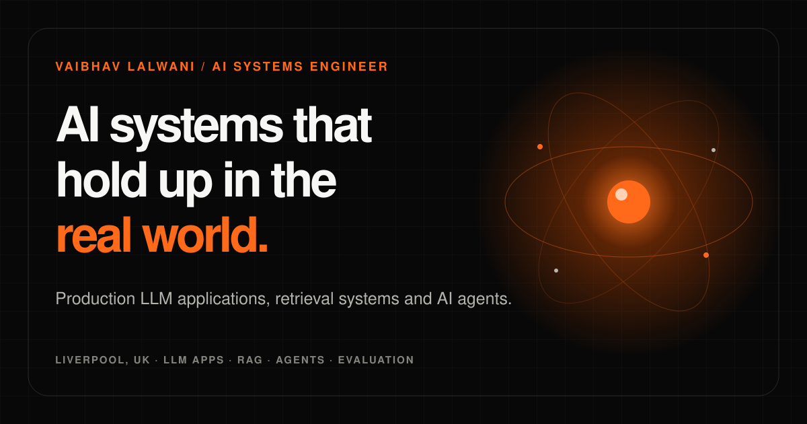

# Vaibhav Lalwani — AI Systems Engineer

<p align="center">
  <a href="https://vaibhavlalwani.vercel.app">
    
  </a>
</p>

<p align="center">
  <a href="https://vaibhavlalwani.vercel.app"><strong>Live portfolio</strong></a>
  · <a href="https://vaibhavlalwani.vercel.app/work">Work archive</a>
  · <a href="https://www.linkedin.com/in/vaibhav-lalwani">LinkedIn</a>
  · <a href="https://github.com/vaibhav4046">GitHub</a>
</p>

A fast, proof-first portfolio for production LLM applications, retrieval systems and AI agents. The site is hand-built with semantic HTML, modern CSS and dependency-free JavaScript, then deployed from `main` to Vercel.

## What makes it different

- **One purposeful 3D scene:** a procedural AI systems core rendered with projected 3D geometry, pointer depth and no runtime library.
- **Proof over project grids:** three flagship systems lead with the problem, engineering decision, outcome, live product and source.
- **Readable by default:** high-contrast black, warm white, grey and orange; restrained motion; visible focus; semantic headings.
- **Progressive enhancement:** the portfolio content remains usable if JavaScript, animation or the canvas is unavailable.
- **Mobile-aware:** accessible navigation, compact layouts, capped canvas density and a 30 fps mobile render budget.
- **No framework or tracker:** no client framework, analytics SDK or third-party font request on the critical path.

## Site map

- `/` — positioning, selected work, about, experience, recognition, research, capabilities, education and contact
- `/work` — complete work archive
- `/work/{project}` — six detailed case studies
- `/Vaibhav_Lalwani_Resume.pdf` — résumé

## Architecture

| File | Responsibility |
|---|---|
| `index.html` | Homepage content and structured metadata |
| `style.css` | Design tokens, responsive layout, accessibility and motion |
| `script.js` | Navigation, reveal logic and procedural 3D renderer |
| `scripts/build-pages.cjs` | Canonical archive and case-study data/templates |
| `scripts/site-audit.mjs` | Static route, metadata, asset and link-integrity checks |
| `work.html`, `work/*.html` | Generated archive and case-study output |
| `vercel.json` | Clean URLs, security headers and cache policy |

## Run locally

```bash
python3 -m http.server 4173
```

Open `http://localhost:4173`.

## Generate and verify

```bash
npm run generate
npm test
```

The audit checks all eight HTML pages, internal routes and assets, heading structure, canonical metadata, image alternatives, external-link safety, syntax and accidental theme/font regressions.

## Performance contract

- Core content is normal HTML; the canvas is decorative.
- Device pixel ratio is capped at `1.5` (`1.25` on small screens).
- Animation pauses offscreen and when the tab is hidden.
- Reduced-motion and data-saver users receive a static frame.
- Project screenshots use WebP with PNG fallbacks.
- Target Core Web Vitals: LCP ≤ 2.5 s, INP ≤ 200 ms, CLS ≤ 0.1.

## Deployment

Vercel is connected to `vaibhav4046/vaibhav-portfolio` with Framework Preset **Other**, repository root as the output, and `main` as the production branch. A push to `main` updates [vaibhavlalwani.vercel.app](https://vaibhavlalwani.vercel.app).

This README and social preview are intentionally designed to make the repository useful when pinned on the GitHub profile. Pinning itself is GitHub profile metadata and must be done from **Profile → Customize your pins**.
