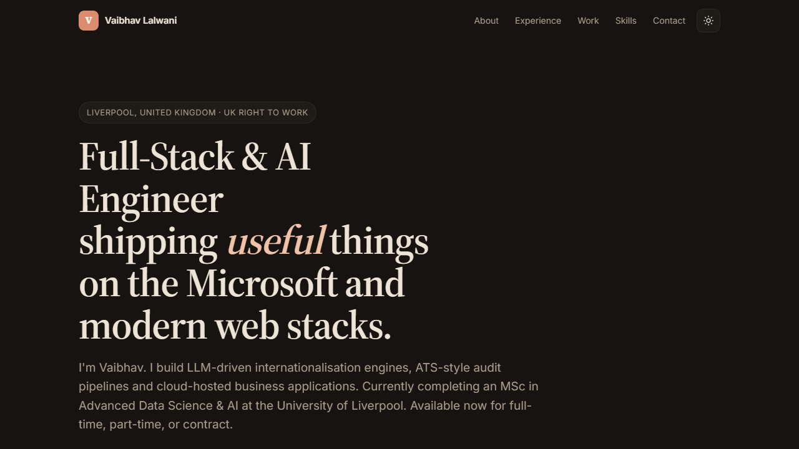

# Vaibhav Lalwani — Portfolio

<p align="center">
  <a href="https://vaibhavlalwani.vercel.app"></a>
</p>

Static, hand-coded portfolio site. No build step. The repository root is the single deployment source for Vercel.

## Files

- `index.html` — content
- `style.css` — design tokens + layout
- `script.js` — theme toggle, sticky bar, footer year
- `vercel.json` — static routing and cache policy for Vercel

## Run locally

Open `index.html` in your browser. That's it.

For a dev server (auto-reload):
```
cd portfolio
python -m http.server 8000
# then open http://localhost:8000
```

## Deploy

### GitHub Pages
1. Push folder to a public repo named `portfolio` (or any).
2. Settings → Pages → Source: `main` branch, root.
3. Live at `https://<your-handle>.github.io/portfolio/`.

### Vercel
1. Connect GitHub repository `vaibhav4046/vaibhav-portfolio`.
2. Production branch: `main`.
3. Framework preset: `Other`.
4. Root directory: repository root (`.`).
5. Build command: empty.
6. Output directory: `.`.

### Netlify
1. Drag the folder into netlify.com app drop zone.
2. Live in seconds.

### Cloudflare Pages
1. Connect repo → build command empty → output dir `/`.
2. Done.

## Custom domain

Point an A or CNAME record to your host. Update `<meta property="og:*">` in `index.html` if you set up social previews.

## Edit content

- Swap in your real GitHub URL where `https://github.com/vaibhav4046` appears.
- Update the experience timeline dates, employers, bullets.
- Add or remove project cards inside the `<section id="work">` block.
- Update contact links at bottom.

## Theming

- Default: dark.
- User preference saved to localStorage.
- Falls back to `prefers-color-scheme` if no preference saved.
- Tweak colours under the `:root` and `[data-theme="dark"]` blocks in `style.css`.

## Accessibility

- Semantic HTML, single h1, clear heading hierarchy.
- High-contrast text in both modes.
- Reduced-motion respected.
- All interactive elements keyboard-reachable.

## Performance

- 3 files, ~25 KB total before fonts.
- Google Fonts preconnected; everything else inline.
- No JavaScript framework. No tracking.
